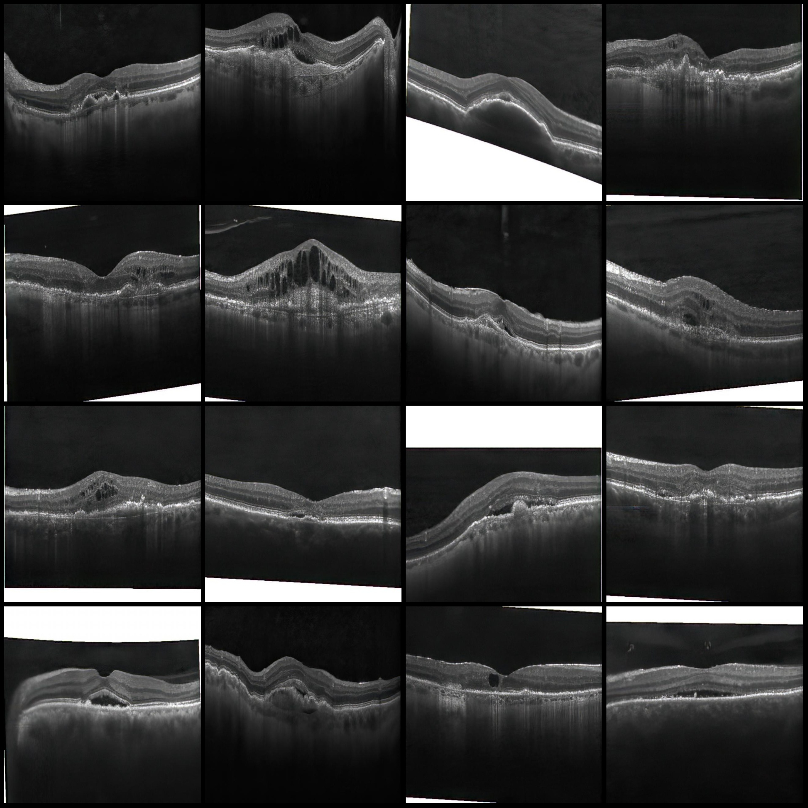
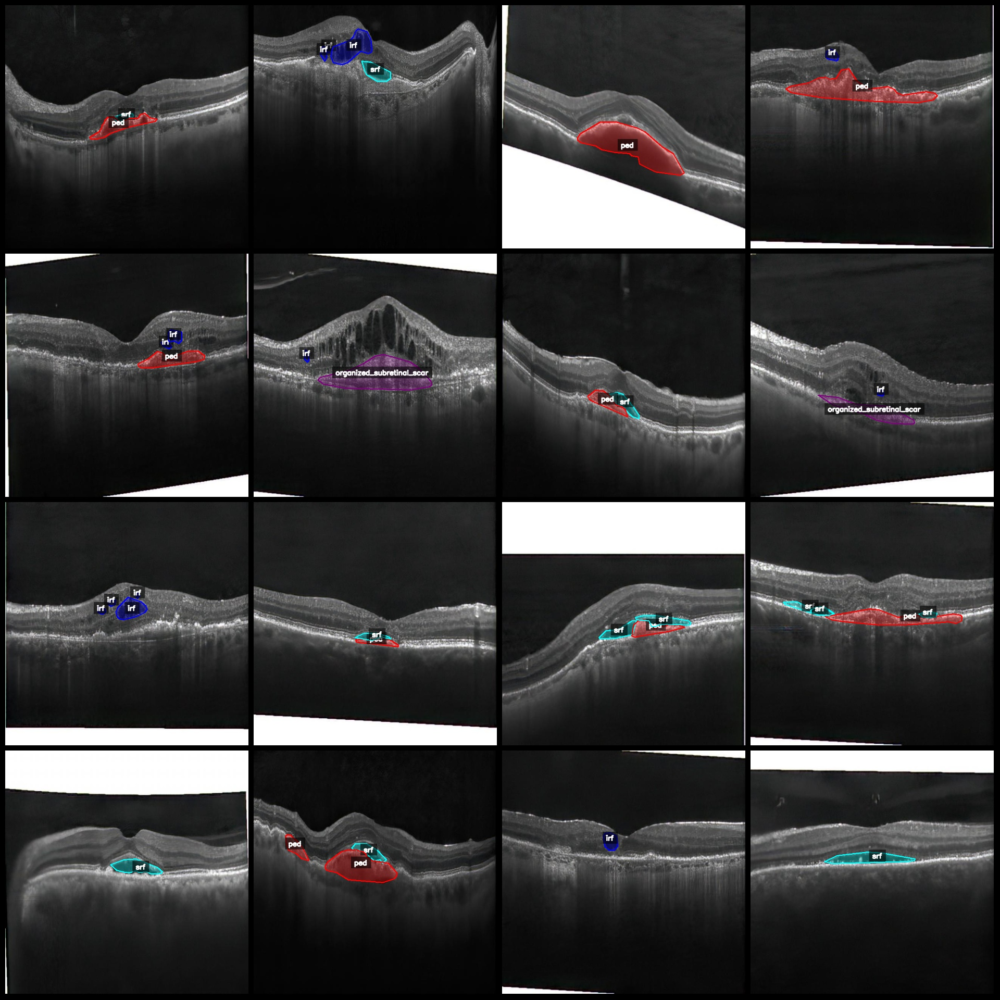
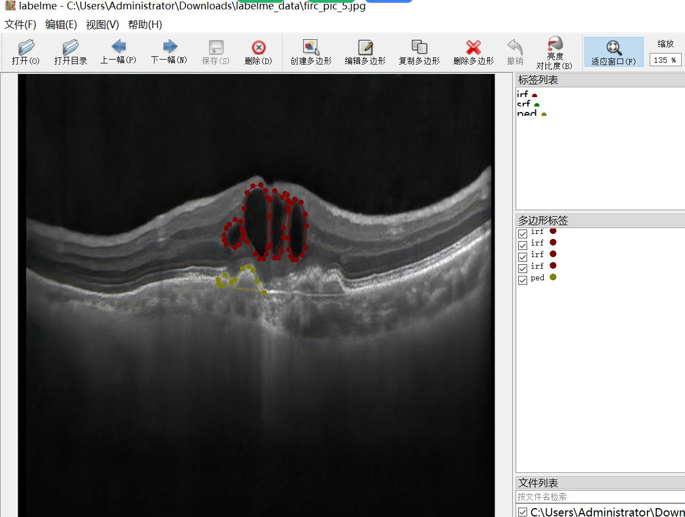
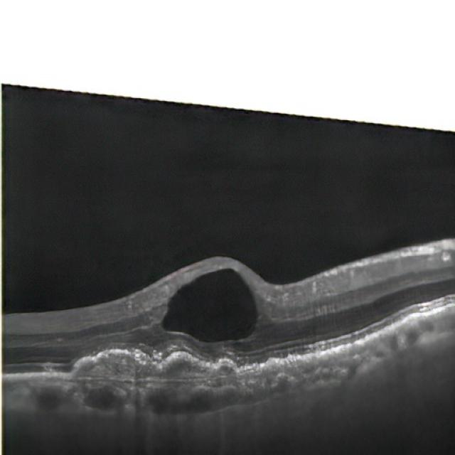
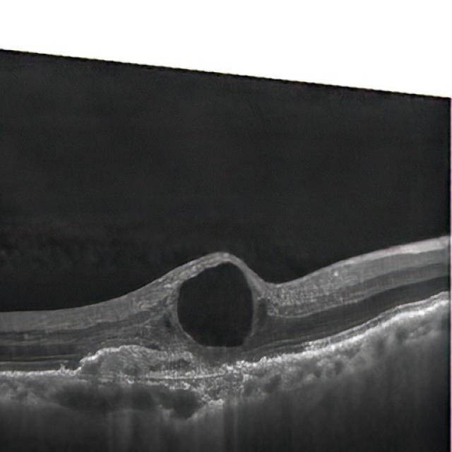
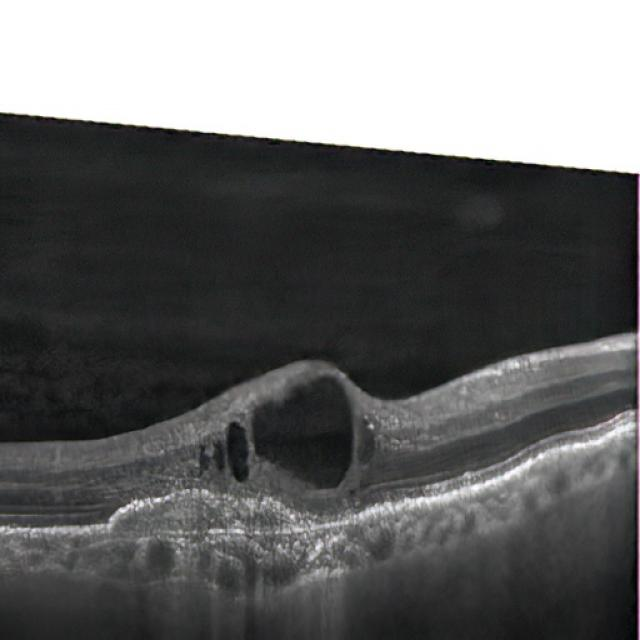
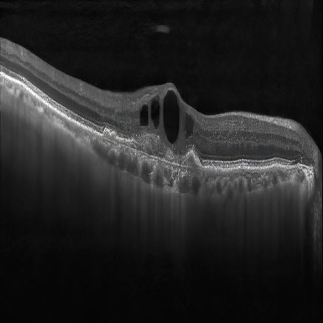

# Smart Medical OCT Retinal Lesion Identification and Segmentation Dataset (labelme format) - 5099 Images with 6 Categories

Dataset format: labelme format (excluding mask files, only containing jpg images and corresponding json files)
Number of images (number of jpg files): 5099
Number of annotations (json files): 5099
Number of annotation categories: 6
Annotation category names: ["irf", "organized_subretinal_scar", "ped", "srf", "subretinal_hyperreflective_material", "virteliform_lesion"]
Number of bounding boxes per category:
irf (Retinal Intrinsic Fluorescence) count = 4878
organized_subretinal_scar (Organized Subretinal Scar) count = 326
ped (Photoreceptor Detached) count = 3611
srf (Subretinal Fluid) count = 3794
subretinal_hyperreflective_material (Subretinal Hyperreflective Material) count = 91
virteliform_lesion (Glasma Vitelliforme Lesion) count = 194
Total bounding boxes: 12894

Annotation tool used: labelme=5.5.0
Image resolution: 640x640
Annotation rules: Polygon for class annotations
Important note: The dataset can be opened and edited using labelme, but the json dataset needs to be converted into mask or yolo format or coco format for instance segmentation or semantic 
segmentation.
Special declaration: This dataset does not guarantee any accuracy in the training model or weight file.

Image previews:
Annotation examples:
Original images (randomly selected 16 images):
Annotation drawing results:
Labelme editing example image:
Some users have complained about poor image quality, here are four original images from the dataset for you to believe that most people have keen eyesight.

## Image

Here is a pay link on Stripe ( https://buy.stripe.com/3cs8yP7sY87d0vu9AB ). Please contact me lonlonago@foxmail.com after funding $89, and I will send you a complete data files , thank you!

